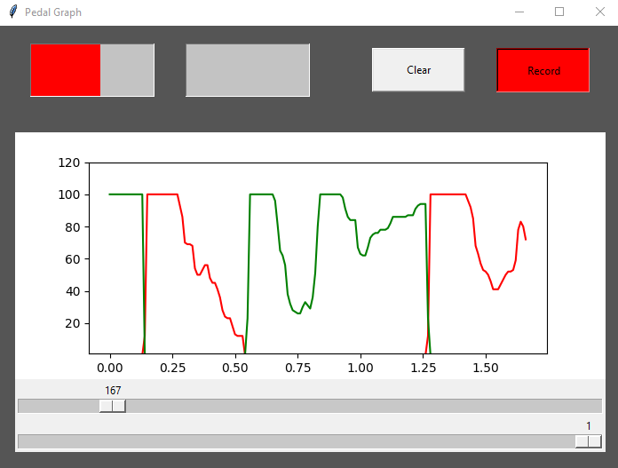

# pedal-graph
Test project for showing telemetry data from xbox controller.
The purpose of this tool is to try out reading controller inputs and using matplotlib to display a graph.



## Tutorial
Run ```python main.py``` in cmd to run.

Make sure a controller supported by the ```inputs``` library is connected. Change values for ```brakebind``` or ```gasbind``` in ```controller``` class if necessary.

## Use this code!
Parts of this code can be used for your own projects.

If you wish to continue programming my tool and uploading it to your github, you have to mention me, the creator, clearly in your project and the readme.
